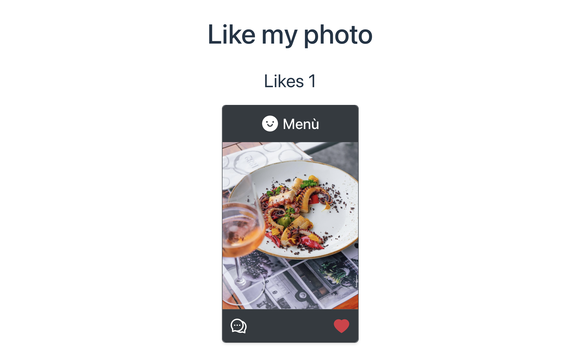

<h1 align="center">Like my photo • ❤️👍</h1>
<h3 align="center">My second React project 
 
https://likemyphotoapp.netlify.app

# 02
My journey discovering React continues.  
With this project, I have implemented the use of one of React's fundamental functions, 'useState'.

The use of 'useState' has allowed me to create interactive components that can adapt and respond in real time to user actions, specifically in this case, liking an image.

  

  

### Languages
• HTML 
• CSS 
• [tailwindcss](https://tailwindcss.com) 
• [React](https://react.dev) 

### Bundler 
[Vite](https://vitejs.dev)

### Webhost
[Netlify](https://www.netlify.com)
